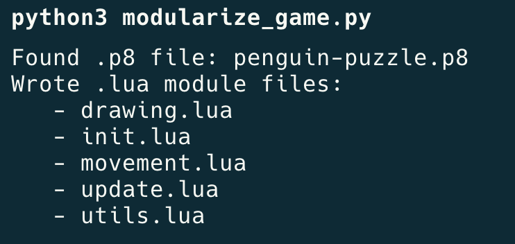

# 🎮👾 PICO-8 DevBuddy

## Description

A series of helpers and utilies designed to **improve the developer experience** on PICO-8!


## Setup

### Prerequisites

- Python 3.x

### Getting Started
To download these utils, run the following from your project directory:

```sh
# Confirm in project directory
pwd

# Clone the repository, then navigate to it
git clone https://github.com/aadriien/pico8-devbuddy.git
cd pico8-devbuddy
```


## Features

### Modular programming with separate files
Tired of searching through your lengthy `.p8` file for snippets of code? Wish you could just break sections down into manageable chunks? `build_game.py` and `modularize_game.py` have you covered!


#### `build_game.py` —> assemble Lua modules into PICO-8 file
Once [set up](#setup), simply run:

```sh
# Confirm .p8 file AND .lua files present at root
ls

python3 build_game.py
```

`build_game.py` will find your `.p8` file, along with any / all `.lua` files. It will assemble the Lua code from each included module into one large block of code, which it will then inject into `.p8`. 

This build script will **ONLY rewrite the code section**, so you can rest assured that your PICO-8 **graphics and map data will remain untouched**. Put simply, you can update the core functionality and logical flow while still preserving game aesthetics.  


#### `modularize_game.py` —> disassemble PICO-8 file into Lua modules
Once [set up](#setup), simply run:

```sh
# Confirm .p8 file present at root
ls

python3 modularize_game.py
```

`modularize_game.py` will find your `.p8` file, parse its contents by PICO-8 tab marker (`-->8`), and break those sections down into separate Lua modules. This will result in individual `.lua` files per tab chunk. 

This modularizing script will **ONLY pull from the code section**, ignoring your PICO-8 graphics and map data. Your original **`.p8` file will remain untouched**. 




