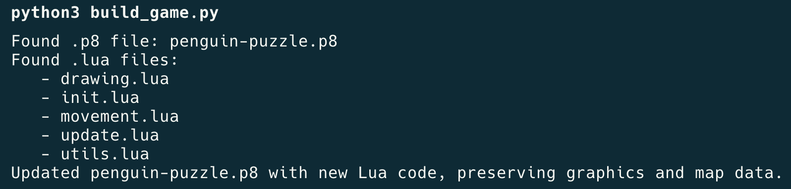

# 🎮👾 Pico-8 DevBuddy

## Description

A series of helpers and utilies designed to improve the developer experience on Pico-8!


### Prerequisites

- Python 3.x


## Features

### Modular programming with separate files
Tired of searching through your lengthy `.p8` file for snippets of code? Wish you could just break sections down into manageable chunks? `build-game.py` has you covered!

Simply run the following from your project directory:

```sh
# Confirm .p8 file AND .lua files present at root
ls

python3 build_game.py
```

`build_game.py` will find your `.p8` file, along with any/all `.lua` files. It will assemble the Lua code from each included module into one large block of code, which it will then inject into `.p8`. 

This script will ONLY rewrite the code section, so you can rest assured that your Pico-8 graphics and map data will remain untouched. Put simply, you can update the core functionality and logical flow while still preserving game aesthetics.  




